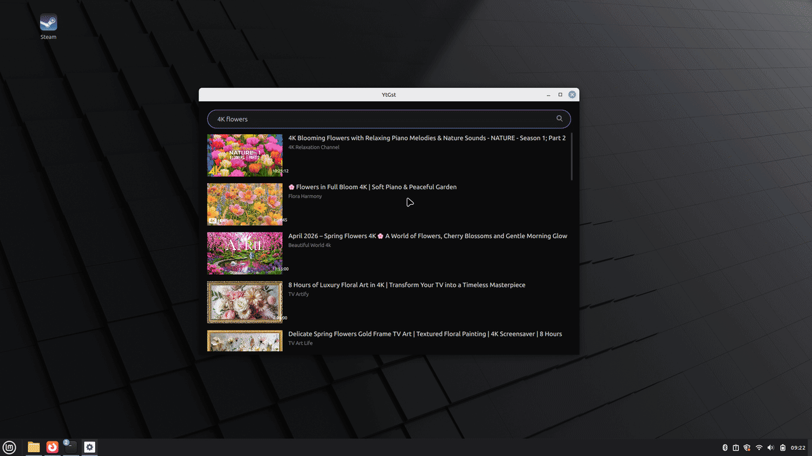
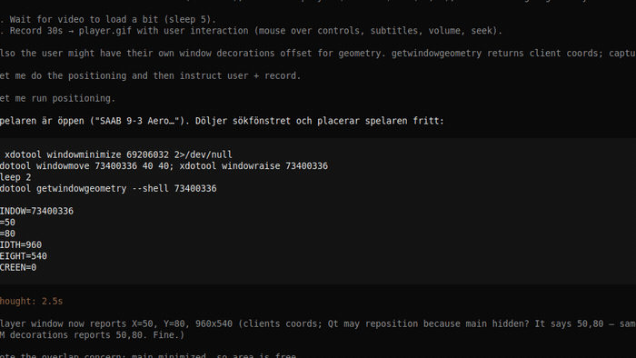

# YtGst

A lightweight YouTube player for Linux.

YtGst has two windows:

- **YtGst** – the search window.
- **YtGst Player** – the player window, opened as a separate process so the
  search window stays open.

It is built from three parts:

| Part | Role |
| --- | --- |
| **yt-dlp** | Fetches metadata and stream URLs from YouTube |
| **GStreamer** | Decodes and plays audio and video |
| **Qt 6 / QML** | Draws the interface and the video |

The goal is GPU-accelerated playback: hardware video decoding (VA-API) and
GPU rendering through OpenGL, so the CPU does as little work as possible.
Software rendering is never the intention.

## Demos

| Searching | Playing |
| --- | --- |
|  |  |

## How it works

1. **Search.** `src/youtube.cpp` queries YouTube's internal "Innertube" API
   with Qt Network. The JSON reply is parsed into `VideoListModel`, which QML
   draws as video cards.
2. **Play.** Clicking a card starts a new process with `--play <video-id>`.
   That process runs `yt-dlp -j` to get metadata and stream URLs, then builds a
   GStreamer pipeline from two `playbin` elements: one for video, one for audio.
   They share a clock, which keeps audio and video in sync.
3. **Render.** The video branch is

   ```text
   glupload → glcolorconvert → capsfilter (RGBA) → qml6glsink
   ```

   `qml6glsink` hands each frame to a `GstGLQt6VideoItem` placed inside the QML
   player window. Qt / QML draws the controls and subtitles on top.

```text
Search window "YtGst"
  │  click a video
  ▼
Player process "YtGst Player"
  ├── yt-dlp -j ──────────────► metadata + HLS URLs (video / audio / subtitles)
  │
  └── GStreamer
        ├── playbin "vplay" → glupload → glcolorconvert → RGBA → qml6glsink ─┐
        └── playbin "aplay" → autoaudiosink                                 │
                                                                            ▼
                                          QML: GstGLQt6VideoItem + controls
```

YtGst prefers YouTube's **HLS** streams (`.m3u8`) because GStreamer can seek in
them.

## Rendering and performance

- **Hardware decoding.** With a working VA-API driver, GStreamer selects a
  hardware decoder such as `vah264dec` instead of a software decoder such as
  `avdec_h264`. YtGst raises the rank of the chosen decoder so it is picked
  first.
- **GPU rendering.** Frames stay in GPU memory (`GLMemory`) and are drawn by
  Qt's GPU scene. Color conversion happens on the GPU (`glcolorconvert`).

### Graphics API: OpenGL only

YtGst uses **OpenGL only** – Vulkan is not used anywhere. Qt is pinned to an
OpenGL context in `src/main.cpp`, because GStreamer's `qml6glsink` requires an
OpenGL context to hand each video frame to Qt. Qt renders the QML interface and
the video through that single OpenGL context.

Hardware decoding is separate from the graphics API: VA-API decodes frames on
the GPU, and the decoded frames are uploaded to GL textures for drawing.

A working graphics driver is required. Without one, Qt can fall back to
software OpenGL (`llvmpipe`) and the CPU does the work, which defeats the
purpose of YtGst.

## Requirements

Package names below are for Debian/Ubuntu-like systems.

**Build tools**

| Package | Purpose |
| --- | --- |
| `cmake` (>= 3.16) | Build system |
| `g++` (C++17) | Compiler |
| `pkg-config` | Locates GStreamer |

**Qt 6 (>= 6.2)**

| Package | Purpose |
| --- | --- |
| `qt6-base-dev` | Qt core and network |
| `qt6-declarative-dev` | Qt Quick / QML |
| `qml6-module-qtquick` | `QtQuick` QML module |
| `qml6-module-qtquick-controls` | `QtQuick.Controls` QML module |

**GStreamer 1.0**

| Package | Provides |
| --- | --- |
| `libgstreamer1.0-dev`, `libgstreamer-plugins-base1.0-dev`, `libgstreamer-gl1.0-dev` | Development headers |
| `gstreamer1.0-plugins-base` | `playbin` and base plugins |
| `gstreamer1.0-plugins-good` | `souphttpsrc` and more |
| `gstreamer1.0-plugins-bad` | `hlsdemux`, `vah264dec` |
| `gstreamer1.0-libav` | Software decoders (fallback) |
| `gstreamer1.0-gl` | `glupload`, `glcolorconvert` |
| `gstreamer1.0-qt6` | `qml6glsink` |

**GPU / video decoding (VA-API)** – pick the one for your card:

| Package | For |
| --- | --- |
| `i965-va-driver` | Older Intel (Haswell/Broadwell) |
| `intel-media-va-driver` | Newer Intel (`iHD`) |
| `mesa-va-drivers` | AMD / Mesa |
| NVIDIA driver | NVIDIA (NVDEC) |

**yt-dlp** is required at runtime but is not bundled. See
[yt-dlp](#yt-dlp) below.

## Build and run

A complete example, from a fresh Debian/Ubuntu machine to a running app.

**1. Install the build dependencies**

```bash
sudo apt update
sudo apt install -y \
  cmake g++ pkg-config \
  qt6-base-dev qt6-declarative-dev \
  qml6-module-qtquick qml6-module-qtquick-controls \
  libgstreamer1.0-dev libgstreamer-plugins-base1.0-dev libgstreamer-gl1.0-dev \
  gstreamer1.0-plugins-base gstreamer1.0-plugins-good gstreamer1.0-plugins-bad \
  gstreamer1.0-libav gstreamer1.0-gl gstreamer1.0-qt6 \
  i965-va-driver intel-media-va-driver mesa-va-drivers
```

**2. Get the source**

```bash
git clone https://github.com/DanielMartensson/YtGst.git
cd YtGst
```

**3. Configure with CMake**

```bash
cmake -S . -B build -DCMAKE_BUILD_TYPE=Release
```

`-S .` is the source directory, `-B build` the build directory. CMake creates
`build/`, keeps the source tree clean, and prints what it detected:

```text
-- yt-dlp: /home/your-user/.local/bin/yt-dlp
-- Video decoder: vah264dec
```

If yt-dlp is not found, or you want another decoder, add flags:

```bash
cmake -S . -B build -DCMAKE_BUILD_TYPE=Release \
  -DYTGST_YTDLP_PATH=/home/your-user/.local/bin/yt-dlp \
  -DYTGST_VIDEO_DECODER=vah264dec \
  -DYTGST_VAAPI_DRIVER=i965
```

**4. Build**

```bash
cmake --build build -j"$(nproc)"
```

The executable is written to `build/ytgst`.

**5. Run**

```bash
./build/ytgst
```

**Everyday rebuilding.** After the first configuration, only:

```bash
cmake --build build -j"$(nproc)"
```

**Clean rebuild.** Delete the build directory and configure again:

```bash
rm -rf build
cmake -S . -B build -DCMAKE_BUILD_TYPE=Release
cmake --build build -j"$(nproc)"
```

**Debug build.** Use a separate build directory:

```bash
cmake -S . -B build-debug -DCMAKE_BUILD_TYPE=Debug
cmake --build build-debug -j"$(nproc)"
./build-debug/ytgst
```

**Install system-wide**

```bash
sudo cmake --install build
```

## Compile-time options

These are set when configuring with CMake, so YtGst can adapt to different
machines without code changes.

| Option | Default | Meaning |
| --- | --- | --- |
| `YTGST_YTDLP_PATH` | empty (auto-detected) | Path to yt-dlp. Empty = auto via `find_program`, then `PATH`. |
| `YTGST_VIDEO_DECODER` | `vah264dec` | GStreamer video decoder to prioritize. |
| `YTGST_VAAPI_DRIVER` | empty (auto `i965`) | Value for `LIBVA_DRIVER_NAME`, e.g. `i965` or `iHD`. |

Common decoder values:

| Value | Type |
| --- | --- |
| `vah264dec`, `vah265dec` | Intel/AMD VA-API (H.264 / H.265) |
| `nvdec_h264`, `nvh264dec` | NVIDIA NVDEC |
| `avdec_h264` | Software decoder (CPU), fallback only |

Example:

```bash
cmake -S . -B build \
  -DYTGST_VIDEO_DECODER=vah265dec \
  -DYTGST_VAAPI_DRIVER=iHD
cmake --build build -j"$(nproc)"
```

## yt-dlp

yt-dlp is a standalone Python program that YtGst starts as a subprocess. It is
not bundled and must be installed separately.

**Where YtGst looks for it, in order:**

1. The path compiled in via `YTGST_YTDLP_PATH` (used if the file exists).
2. The system `PATH`, like any normal command.

So yt-dlp can live almost anywhere as long as it can be found, for example
`/usr/bin/yt-dlp`, `/usr/local/bin/yt-dlp` or `~/.local/bin/yt-dlp`.

**Install (recommended, standalone binary):**

```bash
mkdir -p ~/.local/bin
curl -L https://github.com/yt-dlp/yt-dlp/releases/latest/download/yt-dlp \
  -o ~/.local/bin/yt-dlp
chmod +x ~/.local/bin/yt-dlp
echo 'export PATH="$HOME/.local/bin:$PATH"' >> ~/.bashrc
```

**Install via package manager (may be older):**

```bash
sudo apt install yt-dlp
# or
pipx install yt-dlp
```

**Update now and then**, since YouTube changes often:

```bash
yt-dlp -U          # standalone binary
pipx upgrade yt-dlp
```

## Downloads

Click the download button (or press `D`) to download the current video.

- **Folder:** the system download folder, normally `~/Downloads`. If it cannot
  be found, the movies folder is used, then the home directory.
- **File name:** `%(title)s [%(id)s].%(ext)s`, e.g.
  `Never Gonna Give You Up [dQw4w9WgXcQ].mkv`.
- **Format:** best video + best audio, merged into a single **MKV** file.
- **Progress** is shown in a small box above the button.
- **Cancel:** click the button again (or press `D` again).

yt-dlp is run with approximately:

```text
--newline --no-warnings --no-playlist
-P <download folder>
-o "%(title)s [%(id)s].%(ext)s"
-f bestvideo+bestaudio/best
--merge-output-format mkv
<video URL>
```

## Project structure

```text
ytgst/
├── CMakeLists.txt        Build rules, dependencies and compile-time options
├── qml/
│   ├── Main.qml          Search window "YtGst"
│   ├── PlayerWindow.qml  Player window "YtGst Player" with all controls
│   ├── SearchBar.qml     Search field
│   ├── VideoCard.qml     One video card in the list
│   └── Spinner.qml       Loading indicator
└── src/
    ├── main.cpp          Entry point, graphics API, starts the player process
    ├── player.cpp/.h     Player: yt-dlp, GStreamer pipeline, subtitles, download
    ├── youtube.cpp/.h    YouTube search (Innertube)
    ├── videomodel.cpp/.h List model with video cards
    └── ytdlp.h           Locates yt-dlp (compiled path or PATH)
```

| File | Responsibility |
| --- | --- |
| `src/main.cpp` | Initializes GStreamer, selects VA-API driver and decoder, pins Qt to OpenGL, opens the search or player window. `Launcher` starts the player process. |
| `src/player.*` | Fetches metadata with yt-dlp, builds the pipeline, and handles play/pause, seek, speed, resolution, volume, subtitles and downloads. Exposed to QML via `Q_PROPERTY` / `Q_INVOKABLE`. |
| `src/youtube.*` | Sends search and continuation requests to YouTube's internal API, parses the JSON, and fetches like counts in the background with yt-dlp. |
| `src/videomodel.*` | A `QAbstractListModel` holding the video list. |
| `src/ytdlp.h` | Small helper returning the yt-dlp path. |
| `qml/Main.qml` | Search field, list and error messages. |
| `qml/PlayerWindow.qml` | Video surface, seek bar, play/pause, speed, resolution, subtitles, fullscreen, download and volume. Controls fade out after 5 s. |

## Subtitles

YtGst supports both **manual** subtitles (made by the channel) and
**automatically generated or translated** subtitles.

1. When a video is loaded, all tracks are listed in the CC menu.
2. Picking a language fetches the subtitle into a **per-language cache**, so
   switching back and forth is fast.
3. Subtitles are parsed into time-stamped cues and shown in a box at the
   bottom. The format is YouTube's `json3` first, otherwise VTT.

**Cookies from the browser.** YouTube requires an authenticated request for
automatically translated subtitles (otherwise `HTTP 429`). YtGst lets yt-dlp
fetch **cookies from an installed browser** (Firefox, Chromium, Chrome, Brave,
Edge, Vivaldi or Opera) when a video is loaded. The cookies are written to a
temporary file that is read and deleted immediately; only `youtube.com`
receives them. Sign in to YouTube in your browser for best results. Without a
browser, manual subtitles still work.

## Keyboard shortcuts

| Key / action | Function |
| --- | --- |
| Click a video (search window) | Open it in a new player window |
| `M` | Mute on/off |
| `Up` / `Down` | Volume up / down |
| `D` | Start / cancel download |
| `F` or `F11` | Fullscreen on/off |
| `Esc` | Leave fullscreen, otherwise close the window |

## Troubleshooting

**"qml6glsink saknas – installation av gstreamer1.0-qt6 krävs"**

```bash
sudo apt install gstreamer1.0-qt6
```

**"yt-dlp hittades inte"** – install yt-dlp and make sure it is in `PATH`, or
build with `-DYTGST_YTDLP_PATH=/path/to/yt-dlp`.

**Black screen / no video** – check that the GPU and OpenGL work:

```bash
glxinfo | grep "OpenGL renderer"     # should show your GPU, not llvmpipe
vainfo                               # should show VA-API profiles
```

**Stuttering or high CPU**

- Check that hardware decoding is used: run with `GST_DEBUG=3` and look for
  `vah264dec`, or test `gst-inspect-1.0 vah264dec`.
- Try another decoder or VA driver via the compile-time options.
- Make sure you are not on software OpenGL (`llvmpipe`).

**Subtitles only work for some languages** – sign in to YouTube in your
browser; automatically translated subtitles require cookies.

**Debug with GStreamer**

```bash
GST_DEBUG=3 ./build/ytgst            # very verbose
GST_DEBUG=*:4 ./build/ytgst 2> gst.log
```

## Known limitations

- **GPU rendering only.** Without a working graphics driver, Qt may fall back
  to software OpenGL and CPU usage becomes high.
- **OpenGL only.** Rendering is OpenGL. GStreamer 1.24 has no Vulkan sink for
  Qt, so Vulkan is not used.
- **HLS is preferred.** YtGst selects HLS streams because they can be seeked.
  Some high resolutions may not exist in HLS, so the best available
  alternative is used.
- **Subtitles may require signing in** (cookies) to YouTube.
- **Network is always required.** Neither search nor playback works offline.
- **yt-dlp must be reasonably up to date**, since YouTube changes often.


